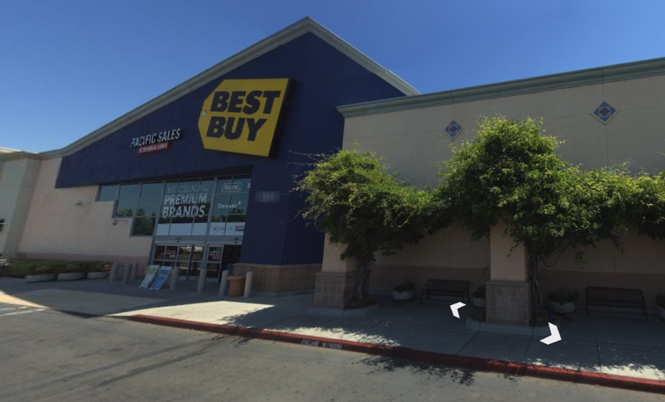

# Image (2) _osint_

|index|
|---|
| [Image](#image) |
| [Questions](#questions) |

 

## Image

 

## Questions

1. What is the _address for this location_?

2. How many AC (Air conditioner) units are on the roof of this building?
