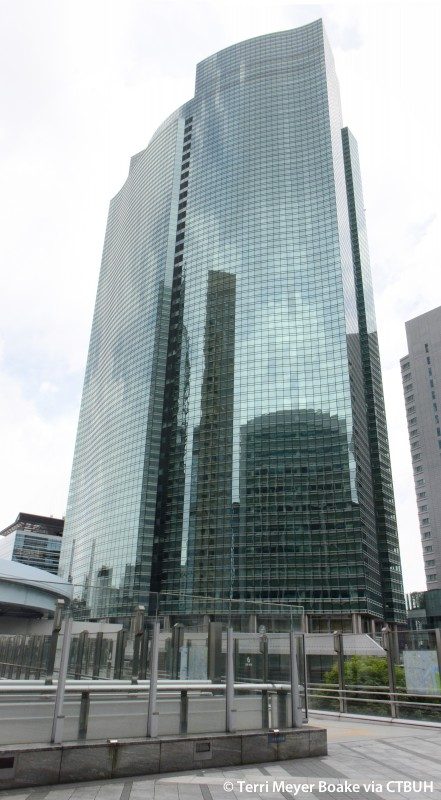

# Image (1) _osint_

|index|
|---|
| [Image](#image) |
| [Questions](#questions) |

 

## Image

 

## Questions

1. When was this building _opened_?

2. Where is this building _located_?

3. What is the _name_ of this building?
